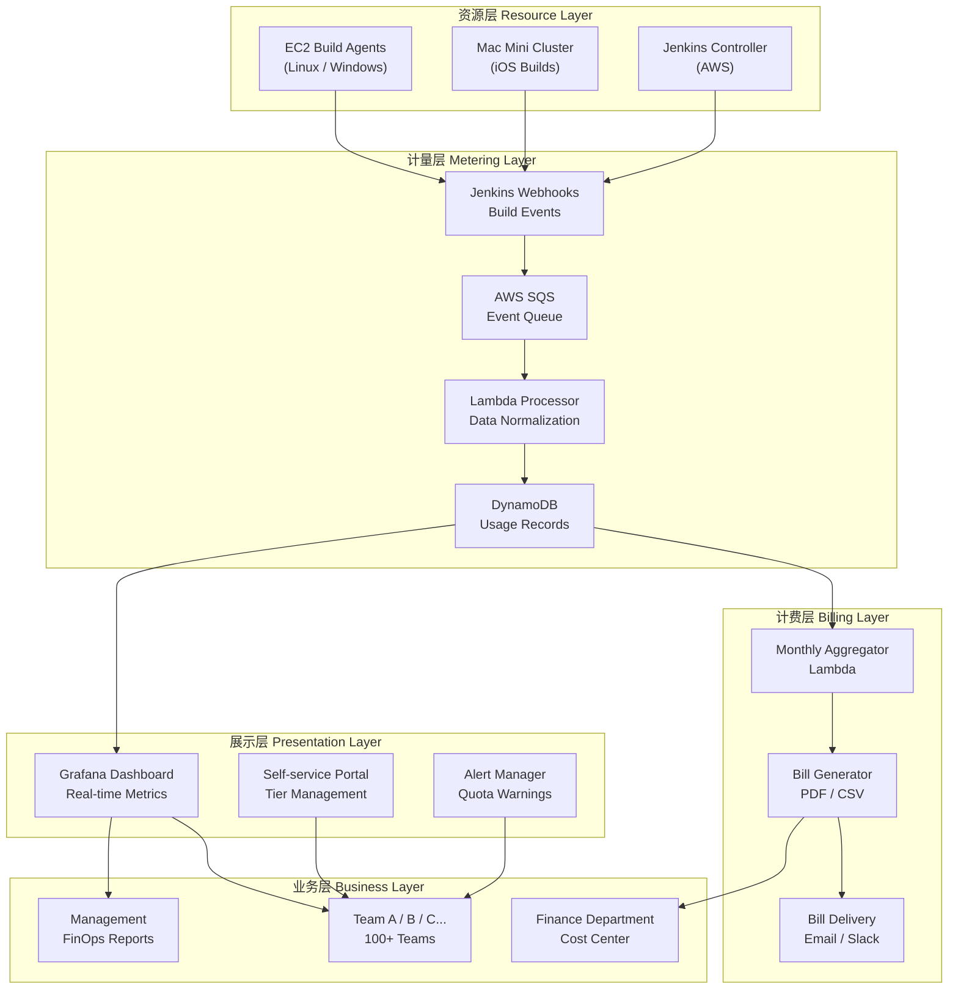

# 计费模式总览

## 1. 设计目标与原则

Jenkins Build Service 的内部计费模式遵循以下四大核心原则：

### 1.1 公平性（Fairness）

- 资源使用量决定付费金额，多用多付、少用少付
- 同等资源类型收取相同单价，不因团队规模或地位差异而不同
- 超额部分按量计费，而非对所有团队统一惩罚
- 失败构建按实际占用资源时长计费，避免恶意或低质量构建免费占用资源

### 1.2 透明性（Transparency）

- 每个团队可随时在 Dashboard 查看实时用量和费用
- 账单细目清晰，每笔构建记录可追溯
- 价格构成公开（成本 + Margin），接受团队审查
- 每月主动推送账单报告，不让团队被动等待

### 1.3 可预测性（Predictability）

- Tier 制提供固定月基础费，团队可以预算
- 配额内用量费用固定，不会因单月突发使用而产生巨额账单
- 超额单价提前公示，团队可以计算最坏情况成本
- 提供用量趋势预测，帮助团队提前选择合适 Tier

### 1.4 激励优化（Incentive for Optimization）

- 差异化定价（EC2 < Mac Mini）引导团队优先使用弹性资源
- Dashboard 提供构建优化建议，帮助团队降低成本
- 年度预付折扣激励团队做长期预算规划
- Tier 升降级灵活，鼓励团队按实际需求选择

---

## 2. 计费模式整体架构



---

## 3. 核心概念定义

### 3.1 Build Minute（构建分钟）

**定义**：一次构建任务从 Agent 开始执行（`build started`）到构建结束（`build completed` / `build failed` / `build aborted`）的实际运行时长，以分钟为单位，**向上取整**。

**计量规则**：
- 最小计费单位：1 分钟（即使构建只运行了 10 秒，也计为 1 分钟）
- **不含** Queue Time（排队等待时间不计入账单，但记录用于 SLA 分析）
- **包含** 失败构建（`FAILURE`, `UNSTABLE`）——失败也占用了实际资源
- **不包含** `ABORTED` 状态（在 Agent 分配之前中止的构建）
- 并发构建按各自时长分别计算，不合并

**示例**：
```
构建 A: 排队 5min → 运行 12min 30sec → SUCCESS
  计费：13 Build Minutes（12:30 向上取整到 13）

构建 B: 排队 2min → 运行 0min 45sec → FAILURE
  计费：1 Build Minute（最小计费单位）

构建 C: 排队 8min → 未分配 Agent → ABORTED
  计费：0 Build Minutes
```

### 3.2 Node Type（节点类型）

Build Agent 按资源类型和规格划分为以下几类，对应不同单价：

| Node Type | Jenkins Label | 对应资源 | 差异化说明 |
|-----------|--------------|---------|-----------|
| `ec2-small` | `ec2-linux-small` | `t3.medium` / `c5.large` | 轻量构建、测试 |
| `ec2-medium` | `ec2-linux-medium` | `c5.2xlarge` / `c5.4xlarge` | 标准 Android 构建 |
| `ec2-large` | `ec2-linux-large` | `c5.9xlarge` / `c5.18xlarge` | 重型编译、多模块 |
| `mac-mini-m1` | `mac-mini-ios-m1` | Apple Mac Mini M1 | iOS 构建（低频高价）|
| `mac-mini-m2` | `mac-mini-ios-m2` | Apple Mac Mini M2 | iOS 构建（高性能）|

### 3.3 Tier（服务等级）

服务等级是团队与平台签订的月度服务合约，包含：
- **固定月基础费**：无论实际用量，每月固定支付
- **包含配额**：基础费涵盖的 Build Minutes 和其他资源上限
- **超额单价**：超出配额后的按量计费单价
- **SLA 等级**：排队优先级和技术支持响应时间

### 3.4 Quota（配额）

Quota 是 Tier 合约中包含的资源上限：
- **Soft Quota**：达到 80% 时触发预警通知
- **Hard Quota**：达到 100% 后触发告警，超出部分自动切换为按量计费（超额）
- 配额按**自然月**重置（每月 1 日 00:00 UTC+8 重置）
- 配额**不可跨月结转**（当月未用完的配额不延续到下月）

### 3.5 Overage（超额费用）

超出 Tier 配额的用量按超额单价计费：
- 超额单价 < Tier 基础费单价（鼓励超额而非选择更高 Tier 时不必要浪费）
- 超额费用按月末实际用量结算
- 超额超过配额 50% 时，系统推荐升级 Tier

### 3.6 Build Credit（构建积分）

- 年度预付的团队可获得 Build Credit
- Build Credit 优先于配额消耗
- 用于年度预付折扣的兑现

### 3.7 Cost Center（成本中心）

每个团队对应一个公司内部 Cost Center 编号，用于：
- 内部转账（Chargeback）
- 财务系统对账
- 管理层报表归集

---

## 4. 与公司内部 Cost Center / Chargeback 流程对接

### 4.1 对接流程概述

```
平台团队生成月度账单
        ↓
账单经平台团队 Manager 审核
        ↓
通过内部工单系统发送到各团队 Manager
        ↓
各团队 Manager 确认用量（5个工作日内）
        ↓
有异议 → 走争议处理流程（见 08-rollout-strategy.md）
无异议 → 发起内部转账申请
        ↓
财务部门执行 Cost Center 之间的内部转账
        ↓
平台团队收到入账确认
        ↓
下月账单归零，重新计量
```

### 4.2 数据字段映射

| 账单字段 | 内部财务字段 | 说明 |
|---------|------------|------|
| `team_id` | Cost Center Code | Jenkins Folder 名称映射到 Cost Center |
| `billing_period` | 账期 | YYYY-MM 格式 |
| `base_fee` | 固定服务费 | Tier 月基础费 |
| `overage_fee` | 超额使用费 | 按量计费部分 |
| `addon_fee` | 增值服务费 | Add-on 费用 |
| `total_amount` | 应付金额 | 单位：人民币（CNY）或美元（USD），按公司规定 |

### 4.3 Cost Center 映射表维护

平台团队维护一张 `team_costcenter_mapping` 表：

```json
{
  "team_id": "mobile-team-android",
  "jenkins_folder": "mobile/android",
  "cost_center_code": "CC-1001",
  "cost_center_name": "移动端 Android 团队",
  "finance_contact": "finance-manager@company.com",
  "team_manager": "team-manager@company.com",
  "tier": "standard",
  "effective_date": "2024-01-01"
}
```

该表由平台团队通过内部 CMDB 或 Git 仓库维护，每季度与财务部门校对一次。

### 4.4 账单周期与结算时间表

| 时间 | 事项 |
|------|------|
| 每月 1 日 | 上月数据冻结，开始生成账单 |
| 每月 3 日 | 账单草稿生成完成，平台团队内部审核 |
| 每月 5 日 | 账单发送给各团队 Manager |
| 每月 10 日 | 团队确认截止日 |
| 每月 12 日 | 争议处理截止日 |
| 每月 15 日 | 发起财务内部转账 |
| 每月 20 日 | 转账完成，财务确认 |

---

## 5. 计费模式演进路线

| 版本 | 特性 | 目标时间 |
|------|------|---------|
| v1.0 | 基础 Tier + 超额计费，EC2 + Mac Mini | 上线第 1 个月 |
| v1.1 | Add-on 服务上线，存储计费 | 上线第 3 个月 |
| v1.2 | 基于 Spot 比例的动态折扣 | 上线第 6 个月 |
| v2.0 | 按需实例（Pay-as-you-go，无 Tier 固定费） | 上线第 12 个月 |
| v2.1 | ML 驱动的成本预测和自动 Tier 推荐 | 上线第 18 个月 |
