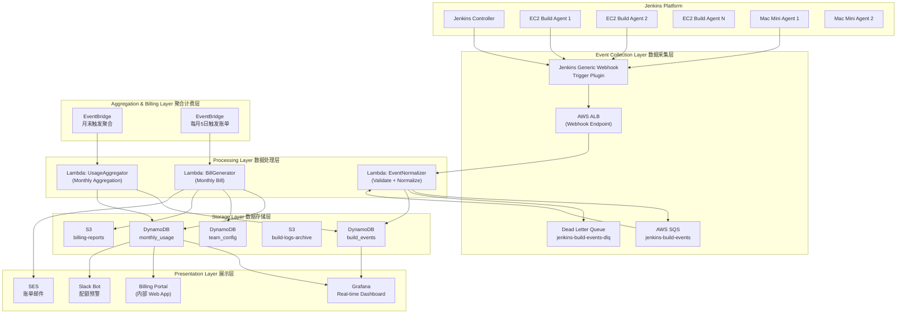
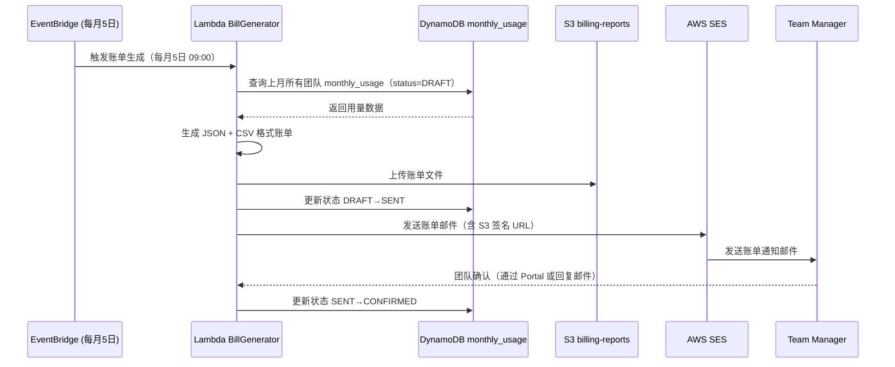

# 计量与计费系统架构

## 1. 整体架构设计



---

## 2. 数据采集层

### 2.1 Jenkins Webhook 配置方法

使用 Jenkins **Generic Webhook Trigger Plugin** 发送构建事件到 AWS ALB。

**Plugin 安装**：
```
Jenkins → Manage Jenkins → Plugin Manager → Available
搜索：Generic Webhook Trigger
安装并重启
```

**全局 Jenkins Webhook 配置（共享 Library 中）**：
```groovy
// vars/notifyBillingSystem.groovy（Jenkins Shared Library）
def call(String event, Map buildInfo) {
    def payload = [
        event_type       : event,                        // BUILD_STARTED / BUILD_COMPLETED
        team_id          : env.TEAM_ID ?: getFolderName(),
        job_name         : env.JOB_NAME,
        job_full_name    : env.JOB_BASE_NAME,
        build_number     : env.BUILD_NUMBER as Integer,
        build_url        : env.BUILD_URL,
        node_name        : env.NODE_NAME,
        node_labels      : env.NODE_LABELS,
        workspace        : env.WORKSPACE,
        timestamp        : new Date().time,
        git_branch       : env.GIT_BRANCH ?: env.BRANCH_NAME,
        git_commit       : env.GIT_COMMIT,
        build_cause      : currentBuild.getBuildCauses()[0]?.shortDescription
    ] + buildInfo

    httpRequest(
        url: "${BILLING_WEBHOOK_URL}/events",
        httpMode: 'POST',
        contentType: 'APPLICATION_JSON',
        requestBody: groovy.json.JsonOutput.toJson(payload),
        authentication: 'billing-webhook-token',
        validResponseCodes: '200:299',
        timeout: 10
    )
}

// 从 Jenkins Folder 名称提取 Team ID
def getFolderName() {
    def jobName = env.JOB_NAME
    def parts = jobName.split('/')
    return parts.length > 1 ? parts[0] : 'unknown'
}
```

**在 Jenkinsfile 中使用（全局 Pipeline 钩子）**：
```groovy
// Jenkinsfile（或全局共享 Library 中的 Wrapper）
pipeline {
    agent { label 'ec2-linux-medium' }

    options {
        // 注册构建开始和结束钩子
    }

    stages {
        stage('Build') {
            steps {
                // 发送 BUILD_STARTED 事件
                notifyBillingSystem('BUILD_STARTED', [
                    queue_entered_at: currentBuild.timeInMillis
                ])
                // ... 实际构建步骤
            }
        }
    }

    post {
        always {
            // 发送 BUILD_COMPLETED 事件
            notifyBillingSystem('BUILD_COMPLETED', [
                build_result    : currentBuild.result,
                build_duration_ms: currentBuild.duration,
                artifact_count  : findFiles(glob: '**/*.apk,**/*.ipa').length
            ])
        }
    }
}
```

### 2.2 采集的数据字段完整列表

| 字段名 | 类型 | 说明 | 示例值 |
|--------|------|------|-------|
| `event_id` | String (UUID) | 事件唯一 ID（Lambda 生成）| `evt_abc123` |
| `event_type` | Enum | 事件类型 | `BUILD_STARTED` / `BUILD_COMPLETED` |
| `team_id` | String | 团队 ID（Jenkins Folder 名）| `mobile-android-team` |
| `job_name` | String | Jenkins Job 完整路径 | `mobile-android-team/app-release/main` |
| `build_number` | Integer | 构建序号 | `1234` |
| `build_url` | String | Jenkins 构建 URL | `https://jenkins.internal/...` |
| `node_name` | String | 执行 Agent 名称 | `ec2-agent-042` / `mac-mini-prod-03` |
| `node_labels` | String | Agent 标签（空格分隔）| `ec2-linux-medium c5.4xlarge` |
| `node_type` | String | 标准化节点类型（Lambda 解析）| `ec2-medium` / `mac-mini-m2` |
| `queue_entered_at` | Long (ms) | 进入队列的时间戳 | `1705305600000` |
| `build_started_at` | Long (ms) | 构建开始（Agent 分配）时间戳 | `1705305627000` |
| `build_ended_at` | Long (ms) | 构建结束时间戳（COMPLETED 事件）| `1705306180000` |
| `build_duration_seconds` | Integer | 构建时长（秒，Lambda 计算）| `553` |
| `build_duration_minutes` | Integer | 构建时长（分钟，向上取整）| `10` |
| `queue_wait_seconds` | Integer | 排队等待时长（秒）| `27` |
| `build_result` | Enum | 构建结果 | `SUCCESS` / `FAILURE` / `UNSTABLE` / `ABORTED` |
| `is_billable` | Boolean | 是否计费（Lambda 判断）| `true` |
| `git_branch` | String | 触发构建的分支 | `main` / `feature/login` |
| `git_commit` | String | Commit SHA | `abc1234` |
| `build_cause` | String | 触发原因 | `SCM change` / `Started by user` |
| `billing_period` | String | 账单周期（Lambda 生成）| `2024-01` |
| `ec2_instance_type` | String | EC2 实例类型（从 node 获取）| `c5.4xlarge` |
| `spot_or_ondemand` | Enum | Spot/On-Demand（从 EC2 Tag 获取）| `spot` / `on-demand` |

### 2.3 事件格式（JSON Schema）

**BUILD_STARTED 事件**：
```json
{
  "$schema": "http://json-schema.org/draft-07/schema#",
  "title": "BuildStartedEvent",
  "type": "object",
  "required": ["event_type", "team_id", "job_name", "build_number", "node_name", "build_started_at"],
  "properties": {
    "event_type": { "type": "string", "enum": ["BUILD_STARTED"] },
    "team_id": { "type": "string", "pattern": "^[a-z0-9-]+$" },
    "job_name": { "type": "string" },
    "build_number": { "type": "integer", "minimum": 1 },
    "build_url": { "type": "string", "format": "uri" },
    "node_name": { "type": "string" },
    "node_labels": { "type": "string" },
    "queue_entered_at": { "type": "integer" },
    "build_started_at": { "type": "integer" },
    "git_branch": { "type": "string" },
    "git_commit": { "type": "string", "pattern": "^[0-9a-f]{7,40}$" },
    "build_cause": { "type": "string" }
  }
}
```

**BUILD_COMPLETED 事件**：
```json
{
  "$schema": "http://json-schema.org/draft-07/schema#",
  "title": "BuildCompletedEvent",
  "type": "object",
  "required": ["event_type", "team_id", "job_name", "build_number", "build_result", "build_ended_at"],
  "properties": {
    "event_type": { "type": "string", "enum": ["BUILD_COMPLETED"] },
    "team_id": { "type": "string" },
    "job_name": { "type": "string" },
    "build_number": { "type": "integer" },
    "build_result": {
      "type": "string",
      "enum": ["SUCCESS", "FAILURE", "UNSTABLE", "ABORTED", "NOT_BUILT"]
    },
    "build_ended_at": { "type": "integer" },
    "build_duration_ms": { "type": "integer" },
    "artifact_count": { "type": "integer" },
    "artifact_size_bytes": { "type": "integer" }
  }
}
```

---

## 3. 数据传输层

### 3.1 SQS vs Kinesis 选型对比

| 对比维度 | SQS Standard | SQS FIFO | Kinesis Data Streams |
|---------|-------------|----------|---------------------|
| **消息顺序** | 不保证 | 严格保证 | 分区内保证 |
| **吞吐量** | 无限 | 3,000 TPS/分区 | 1MB/s 写入/分区 |
| **消息保留** | 最长 14 天 | 最长 14 天 | 最长 365 天 |
| **消息大小** | 最大 256 KB | 最大 256 KB | 最大 1 MB |
| **重复消费** | 可能（at-least-once）| 恰好一次 | 支持多消费者 |
| **延迟** | 毫秒级 | 毫秒级 | 毫秒级 |
| **定价** | $0.40/百万消息 | $0.50/百万消息 | $0.015/分区/小时 |
| **适用场景** | 高吞吐，无序 OK | 需要严格顺序 | 多消费者 / 实时分析 |

**推荐方案**：**SQS Standard** + **Dead Letter Queue**

理由：
- 构建事件不需要严格顺序（计费按总量，不依赖事件顺序）
- SQS Standard 成本更低，吞吐量足够
- 100 个团队，峰值 1,000 次构建/小时 = 2,000 个事件/小时，远未达 SQS 上限
- DLQ 保障消息不丢失

### 3.2 Lambda 处理函数设计

```python
# lambda/event_normalizer.py
import json
import boto3
import math
import uuid
from datetime import datetime

dynamodb = boto3.resource('dynamodb')
table = dynamodb.Table('build_events')

NODE_TYPE_MAPPING = {
    'ec2-linux-small': 'ec2-small',
    'ec2-linux-medium': 'ec2-medium',
    'ec2-linux-large': 'ec2-large',
    'mac-mini-ios-m1': 'mac-mini-m1',
    'mac-mini-ios-m2': 'mac-mini-m2',
}

BILLABLE_RESULTS = {'SUCCESS', 'FAILURE', 'UNSTABLE'}
MIN_BILLABLE_SECONDS = 1  # Agent 已分配就计费

def lambda_handler(event, context):
    """
    触发方式：SQS → Lambda（批处理，每次最多 10 条）
    """
    for record in event['Records']:
        try:
            payload = json.loads(record['body'])
            process_event(payload)
        except Exception as e:
            print(f"Error processing record: {e}")
            raise  # 让 SQS 重试，最终进 DLQ

def process_event(payload):
    event_type = payload.get('event_type')

    if event_type == 'BUILD_STARTED':
        handle_build_started(payload)
    elif event_type == 'BUILD_COMPLETED':
        handle_build_completed(payload)

def handle_build_started(payload):
    """记录构建开始，创建 build_events 条目"""
    event_id = f"{payload['team_id']}#{payload['job_name']}#{payload['build_number']}"
    billing_period = datetime.utcfromtimestamp(
        payload['build_started_at'] / 1000
    ).strftime('%Y-%m')

    node_type = resolve_node_type(payload.get('node_labels', ''))

    item = {
        'pk': f"BUILD#{event_id}",
        'sk': 'METADATA',
        'event_id': event_id,
        'team_id': payload['team_id'],
        'job_name': payload['job_name'],
        'build_number': payload['build_number'],
        'node_name': payload.get('node_name', 'unknown'),
        'node_type': node_type,
        'billing_period': billing_period,
        'build_started_at': payload['build_started_at'],
        'queue_entered_at': payload.get('queue_entered_at', payload['build_started_at']),
        'queue_wait_seconds': calculate_queue_wait(payload),
        'git_branch': payload.get('git_branch', ''),
        'build_cause': payload.get('build_cause', ''),
        'status': 'IN_PROGRESS',
        'created_at': int(datetime.utcnow().timestamp() * 1000),
    }

    table.put_item(Item=item)

def handle_build_completed(payload):
    """更新构建结束信息，计算计费时长"""
    event_id = f"{payload['team_id']}#{payload['job_name']}#{payload['build_number']}"

    # 从 DynamoDB 读取 started 记录（获取 build_started_at）
    response = table.get_item(
        Key={'pk': f"BUILD#{event_id}", 'sk': 'METADATA'}
    )
    existing = response.get('Item', {})
    build_started_at = existing.get('build_started_at', payload['build_ended_at'])

    build_duration_ms = payload.get('build_duration_ms',
        payload['build_ended_at'] - build_started_at)
    build_duration_seconds = build_duration_ms / 1000
    build_duration_minutes = math.ceil(build_duration_seconds / 60)
    # 确保最少 1 分钟
    build_duration_minutes = max(1, build_duration_minutes)

    build_result = payload.get('build_result', 'UNKNOWN')
    is_billable = (
        build_result in BILLABLE_RESULTS and
        build_duration_seconds >= MIN_BILLABLE_SECONDS
    )

    table.update_item(
        Key={'pk': f"BUILD#{event_id}", 'sk': 'METADATA'},
        UpdateExpression="""
            SET build_result = :result,
                build_ended_at = :ended_at,
                build_duration_seconds = :duration_s,
                build_duration_minutes = :duration_m,
                is_billable = :billable,
                #status = :status
        """,
        ExpressionAttributeNames={'#status': 'status'},
        ExpressionAttributeValues={
            ':result': build_result,
            ':ended_at': payload['build_ended_at'],
            ':duration_s': int(build_duration_seconds),
            ':duration_m': build_duration_minutes,
            ':billable': is_billable,
            ':status': 'COMPLETED',
        }
    )

def resolve_node_type(node_labels: str) -> str:
    """从 Jenkins Node Labels 解析标准节点类型"""
    for label, node_type in NODE_TYPE_MAPPING.items():
        if label in node_labels:
            return node_type
    return 'ec2-medium'  # 默认值

def calculate_queue_wait(payload) -> int:
    queue_entered = payload.get('queue_entered_at', 0)
    build_started = payload.get('build_started_at', 0)
    if queue_entered and build_started:
        return max(0, int((build_started - queue_entered) / 1000))
    return 0
```

### 3.3 错误处理和重试策略

```python
# SQS 配置（Terraform 示例）
resource "aws_sqs_queue" "build_events" {
  name                       = "jenkins-build-events"
  visibility_timeout_seconds = 30          # Lambda 超时 × 6
  message_retention_seconds  = 1209600     # 14 天
  receive_wait_time_seconds  = 20          # Long polling

  redrive_policy = jsonencode({
    deadLetterTargetArn = aws_sqs_queue.build_events_dlq.arn
    maxReceiveCount     = 3                 # 失败 3 次后进 DLQ
  })
}

resource "aws_sqs_queue" "build_events_dlq" {
  name                       = "jenkins-build-events-dlq"
  message_retention_seconds  = 1209600
}

# DLQ 告警
resource "aws_cloudwatch_metric_alarm" "dlq_not_empty" {
  alarm_name          = "jenkins-billing-dlq-not-empty"
  comparison_operator = "GreaterThanThreshold"
  threshold           = 0
  metric_name         = "ApproximateNumberOfMessagesVisible"
  namespace           = "AWS/SQS"
  dimensions = {
    QueueName = aws_sqs_queue.build_events_dlq.name
  }
  alarm_actions = [aws_sns_topic.platform_alerts.arn]
}
```

**Lambda 幂等性处理**：
```python
# 使用 DynamoDB 条件写入保证幂等性
table.put_item(
    Item=item,
    ConditionExpression='attribute_not_exists(pk)'  # 已存在则不覆盖
)
```

---

## 4. 数据存储层

### 4.1 DynamoDB 表设计

#### 表 1：`build_events`

| 字段 | 类型 | 说明 |
|------|------|------|
| `pk` (PK) | String | `BUILD#{team_id}#{job_name}#{build_number}` |
| `sk` (SK) | String | `METADATA` |
| `team_id` | String | 团队 ID |
| `billing_period` | String | `2024-01` |
| `node_type` | String | `ec2-medium` |
| `build_duration_minutes` | Number | 计费时长（分钟）|
| `build_result` | String | `SUCCESS` / `FAILURE` 等 |
| `is_billable` | Boolean | 是否计费 |
| `build_started_at` | Number | 时间戳（ms）|
| `build_ended_at` | Number | 时间戳（ms）|
| ... | ... | 其他字段 |

**GSI 1：按团队+账单周期查询**
```
GSI Name: team_billing_period_idx
Partition Key: team_id
Sort Key: billing_period
```

**GSI 2：按账单周期查询所有团队**
```
GSI Name: billing_period_idx
Partition Key: billing_period
Sort Key: build_started_at
```

**DynamoDB 查询示例**：
```python
import boto3
from boto3.dynamodb.conditions import Key, Attr

dynamodb = boto3.resource('dynamodb')
table = dynamodb.Table('build_events')

def get_team_builds_for_period(team_id: str, billing_period: str):
    """获取某团队某月的所有构建记录"""
    response = table.query(
        IndexName='team_billing_period_idx',
        KeyConditionExpression=
            Key('team_id').eq(team_id) &
            Key('billing_period').eq(billing_period),
        FilterExpression=Attr('is_billable').eq(True)
    )
    return response['Items']

def calculate_team_monthly_usage(team_id: str, billing_period: str):
    """计算团队月度用量"""
    builds = get_team_builds_for_period(team_id, billing_period)

    usage = {
        'ec2_minutes': 0,
        'mac_mini_minutes': 0,
        'build_count': 0,
        'ec2_small_minutes': 0,
        'ec2_medium_minutes': 0,
        'ec2_large_minutes': 0,
    }

    for build in builds:
        duration = build.get('build_duration_minutes', 0)
        node_type = build.get('node_type', 'ec2-medium')

        usage['build_count'] += 1

        if node_type.startswith('mac-mini'):
            usage['mac_mini_minutes'] += duration
        else:
            usage['ec2_minutes'] += duration
            if node_type == 'ec2-small':
                usage['ec2_small_minutes'] += duration
            elif node_type == 'ec2-large':
                usage['ec2_large_minutes'] += duration
            else:
                usage['ec2_medium_minutes'] += duration

    return usage
```

#### 表 2：`monthly_usage`（聚合表）

| 字段 | 类型 | 说明 |
|------|------|------|
| `pk` (PK) | String | `USAGE#{team_id}#{billing_period}` |
| `sk` (SK) | String | `SUMMARY` |
| `team_id` | String | 团队 ID |
| `billing_period` | String | `2024-01` |
| `tier` | String | `standard` |
| `ec2_minutes_used` | Number | EC2 用量（分钟）|
| `mac_mini_minutes_used` | Number | Mac Mini 用量（分钟）|
| `build_count` | Number | 构建次数 |
| `storage_gb` | Number | Artifact 存储（GB）|
| `base_fee` | Number | 月基础费（美元）|
| `overage_fee` | Number | 超额费（美元）|
| `addon_fee` | Number | Add-on 费（美元）|
| `total_fee` | Number | 月总费（美元）|
| `generated_at` | String | 生成时间 |
| `status` | String | `DRAFT` / `CONFIRMED` / `INVOICED` |

#### 表 3：`team_config`（团队配置表）

```json
{
  "pk": "TEAM#mobile-android-team",
  "sk": "CONFIG",
  "team_id": "mobile-android-team",
  "display_name": "移动端 Android 团队",
  "cost_center": "CC-1001",
  "finance_contact": "finance@company.com",
  "team_manager": "manager@company.com",
  "tier": "standard",
  "addons": ["dedicated_asg", "build_cache"],
  "ec2_quota_minutes": 2000,
  "mac_mini_quota_minutes": 500,
  "build_count_quota": 1000,
  "storage_quota_gb": 50,
  "effective_date": "2024-01-01",
  "annual_prepaid": false
}
```

### 4.2 数据保留策略

| 表 | 保留策略 |
|----|---------|
| `build_events` | DynamoDB TTL = 2 年（构建历史）|
| `monthly_usage` | 永久保留（财务数据）|
| `team_config` | 永久保留 |
| S3 Billing Reports | 7 年（财务合规要求）|
| CloudWatch Logs | 90 天 |

---

## 5. 数据聚合层

### 5.1 月度聚合 Lambda

```python
# lambda/monthly_aggregator.py
# 触发方式：EventBridge Cron（每月 1 日 00:05 UTC+8）

import boto3
import json
from datetime import datetime, timedelta

def lambda_handler(event, context):
    """月度聚合：计算上月所有团队的用量和费用"""
    # 获取上月账单周期
    today = datetime.utcnow()
    last_month = (today.replace(day=1) - timedelta(days=1))
    billing_period = last_month.strftime('%Y-%m')

    print(f"Starting monthly aggregation for period: {billing_period}")

    # 获取所有活跃团队
    teams = get_all_active_teams()

    for team in teams:
        try:
            aggregate_team_usage(team['team_id'], billing_period)
        except Exception as e:
            print(f"Error aggregating team {team['team_id']}: {e}")
            # 发送告警，继续处理其他团队
            send_alert(f"Aggregation failed for team {team['team_id']}: {e}")

def aggregate_team_usage(team_id: str, billing_period: str):
    """聚合单个团队的月度用量"""
    # 1. 获取构建用量
    usage = calculate_team_monthly_usage(team_id, billing_period)

    # 2. 获取 S3 Artifact 存储量
    storage_gb = get_team_storage_gb(team_id)

    # 3. 获取团队配置
    config = get_team_config(team_id)

    # 4. 计算账单金额
    bill = calculate_bill(config, usage, storage_gb)

    # 5. 写入 monthly_usage 表
    save_monthly_usage(team_id, billing_period, usage, storage_gb, bill)

def calculate_bill(config: dict, usage: dict, storage_gb: float) -> dict:
    """计算账单金额"""
    tier = config['tier']
    tier_config = TIER_CONFIGS[tier]

    base_fee = tier_config['base_fee']

    # EC2 超额费（含阶梯计价）
    ec2_overage_minutes = max(0, usage['ec2_minutes'] - tier_config['ec2_quota'])
    ec2_overage_fee = calculate_tiered_overage(
        tier, 'ec2', ec2_overage_minutes, tier_config['ec2_quota']
    )

    # Mac Mini 超额费
    mac_overage_minutes = max(0, usage['mac_mini_minutes'] - tier_config['mac_quota'])
    mac_overage_fee = mac_overage_minutes * tier_config['mac_overage_price']

    # 超额构建次数
    build_overage = max(0, usage['build_count'] - tier_config.get('build_quota', float('inf')))
    build_overage_fee = build_overage * tier_config.get('build_overage_price', 0)

    # 存储超额费
    storage_overage_gb = max(0, storage_gb - tier_config['storage_quota_gb'])
    storage_overage_fee = storage_overage_gb * 0.025

    total_fee = base_fee + ec2_overage_fee + mac_overage_fee + build_overage_fee + storage_overage_fee

    return {
        'base_fee': base_fee,
        'ec2_overage_fee': round(ec2_overage_fee, 2),
        'mac_overage_fee': round(mac_overage_fee, 2),
        'build_overage_fee': round(build_overage_fee, 2),
        'storage_overage_fee': round(storage_overage_fee, 2),
        'total_fee': round(total_fee, 2),
    }

TIER_CONFIGS = {
    'basic': {
        'base_fee': 500,
        'ec2_quota': 500,
        'mac_quota': 100,
        'build_quota': 200,
        'storage_quota_gb': 10,
        'ec2_overage_price': 0.05,
        'mac_overage_price': 0.15,
        'build_overage_price': 0.10,
    },
    'standard': {
        'base_fee': 1800,
        'ec2_quota': 2000,
        'mac_quota': 500,
        'build_quota': 1000,
        'storage_quota_gb': 50,
        'ec2_overage_price': 0.04,
        'mac_overage_price': 0.12,
        'build_overage_price': 0.05,
    },
    'premium': {
        'base_fee': 5000,
        'ec2_quota': 8000,
        'mac_quota': 2000,
        'build_quota': float('inf'),
        'storage_quota_gb': 200,
        'ec2_overage_price': 0.03,
        'mac_overage_price': 0.10,
        'build_overage_price': 0,
    },
}
```

### 5.2 团队识别

Jenkins **Folder** 作为天然的团队隔离单元：

```
Jenkins Job 路径：mobile-android-team/app-release/feature-login/123

提取逻辑：
team_id = job_name.split('/')[0]  →  "mobile-android-team"
```

**Node Label 映射**（维护在 `team_config` 表中）：
```python
def resolve_node_type(node_labels: str) -> str:
    label_map = {
        'ec2-linux-small': 'ec2-small',
        'ec2-linux-medium': 'ec2-medium',
        'ec2-linux-large': 'ec2-large',
        'ec2-linux-gpu': 'ec2-gpu',
        'mac-mini-ios-m1': 'mac-mini-m1',
        'mac-mini-ios-m2': 'mac-mini-m2',
    }
    for label, node_type in label_map.items():
        if label in node_labels:
            return node_type
    return 'ec2-medium'  # 默认
```

---

## 6. 账单生成

### 6.1 月度账单生成流程



### 6.2 账单格式（JSON）

```json
{
  "bill_id": "BILL-2024-01-mobile-android-team",
  "team_id": "mobile-android-team",
  "team_display_name": "移动端 Android 团队",
  "cost_center": "CC-1001",
  "billing_period": "2024-01",
  "billing_period_start": "2024-01-01",
  "billing_period_end": "2024-01-31",
  "tier": "standard",
  "generated_at": "2024-02-05T09:00:00Z",
  "status": "SENT",

  "usage_summary": {
    "ec2_minutes_used": 2847,
    "ec2_minutes_quota": 2000,
    "ec2_overage_minutes": 847,
    "mac_mini_minutes_used": 623,
    "mac_mini_minutes_quota": 500,
    "mac_mini_overage_minutes": 123,
    "build_count": 1134,
    "build_count_quota": 1000,
    "build_count_overage": 134,
    "storage_gb": 43.7,
    "storage_quota_gb": 50,
    "storage_overage_gb": 0
  },

  "charges": {
    "base_fee": 1800.00,
    "ec2_overage_fee": 42.35,
    "mac_mini_overage_fee": 14.76,
    "build_count_overage_fee": 6.70,
    "storage_overage_fee": 0.00,
    "addon_fees": [
      { "name": "Build Cache (Gradle+npm)", "amount": 350.00 }
    ],
    "subtotal": 2213.81,
    "discount": 0.00,
    "total": 2213.81,
    "currency": "USD"
  },

  "top_jobs": [
    {
      "job_name": "app-release/main",
      "build_count": 234,
      "total_minutes": 876,
      "cost_estimate": 35.04
    }
  ],

  "s3_detail_url": "s3://billing-reports/2024-01/mobile-android-team/detail.csv",
  "pdf_url": "https://billing.jenkins-internal.company.com/bills/BILL-2024-01-mobile-android-team.pdf"
}
```

### 6.3 账单审核和发送流程

```
每月 1 日：数据冻结，聚合 Lambda 运行，生成 DRAFT 账单
每月 3 日：平台团队 Manager 在 Portal 审核所有 DRAFT 账单
每月 5 日：账单状态改为 SENT，SES 发送邮件给各团队 Manager
每月 10 日：团队确认截止，未确认自动视为确认
每月 12 日：争议处理截止
每月 15 日：财务团队发起内部转账
```

---

## 7. 完整示例代码汇总

### Jenkins Webhook Payload 示例

```bash
# BUILD_COMPLETED 事件的实际 HTTP POST 请求
curl -X POST \
  https://billing.jenkins-internal.company.com/events \
  -H 'Content-Type: application/json' \
  -H 'X-Billing-Token: <redacted>' \
  -d '{
    "event_type": "BUILD_COMPLETED",
    "team_id": "mobile-android-team",
    "job_name": "mobile-android-team/app-release/main",
    "build_number": 1234,
    "build_url": "https://jenkins.internal/job/mobile-android-team/job/app-release/1234/",
    "node_name": "ec2-agent-042",
    "node_labels": "ec2-linux-medium c5.4xlarge linux",
    "build_started_at": 1705305627000,
    "build_ended_at": 1705306180000,
    "build_duration_ms": 553000,
    "queue_entered_at": 1705305600000,
    "build_result": "SUCCESS",
    "git_branch": "main",
    "git_commit": "abc1234def",
    "build_cause": "Started by timer"
  }'
```
