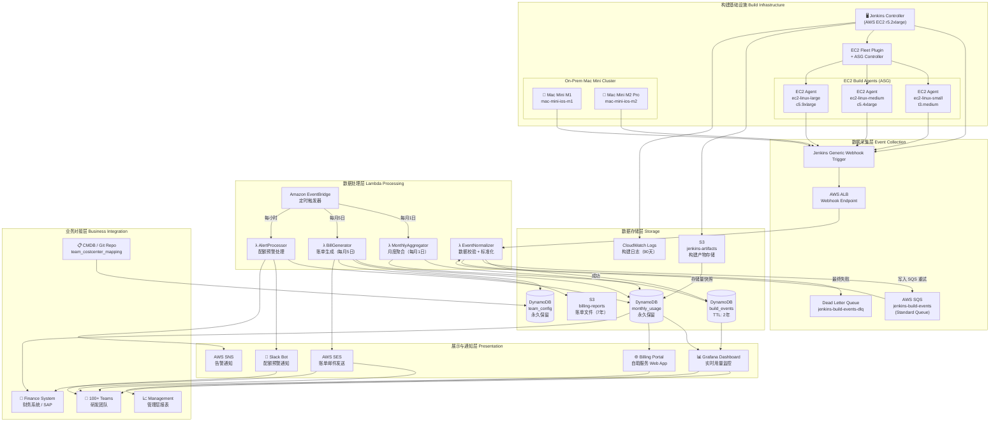
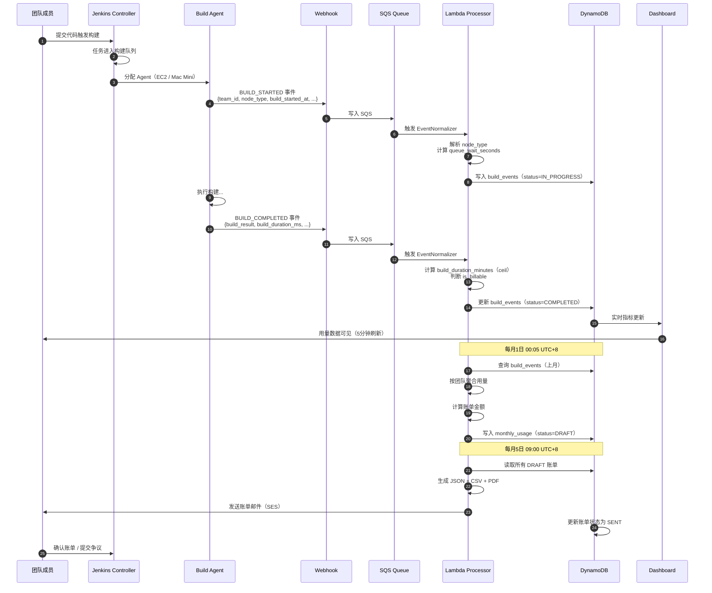
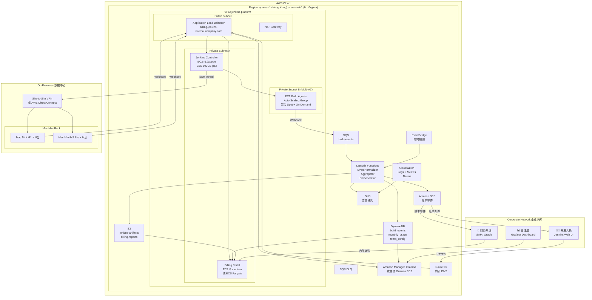
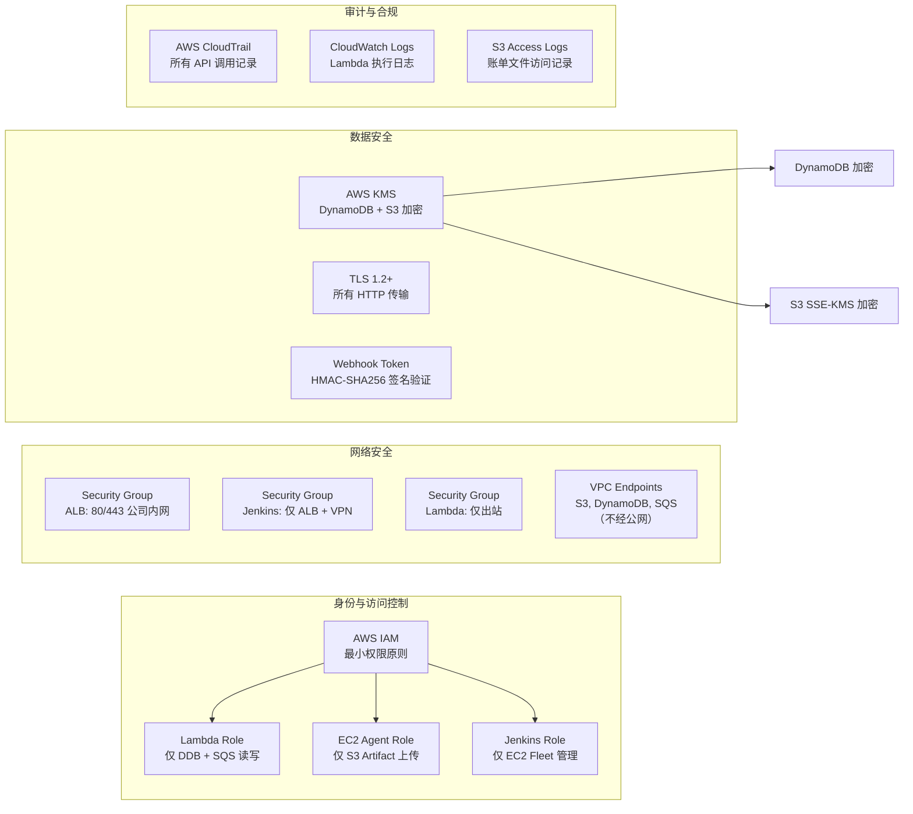

# 系统架构图

## 1. 完整系统架构图

```mermaid
graph TB
    subgraph "构建基础设施 Build Infrastructure"
        direction TB
        JC["🖥️ Jenkins Controller<br/>(AWS EC2 r5.2xlarge)"]
        
        subgraph "EC2 Build Agents (ASG)"
            EA1["EC2 Agent<br/>ec2-linux-small<br/>t3.medium"]
            EA2["EC2 Agent<br/>ec2-linux-medium<br/>c5.4xlarge"]
            EA3["EC2 Agent<br/>ec2-linux-large<br/>c5.9xlarge"]
        end
        
        subgraph "On-Prem Mac Mini Cluster"
            MM1["🍎 Mac Mini M1<br/>mac-mini-ios-m1"]
            MM2["🍎 Mac Mini M2 Pro<br/>mac-mini-ios-m2"]
        end
        
        EC2FLEET["EC2 Fleet Plugin<br/>+ ASG Controller"]
    end

    subgraph "数据采集层 Event Collection"
        WH["Jenkins Generic Webhook Trigger"]
        ALB["AWS ALB<br/>Webhook Endpoint"]
        SQS["AWS SQS<br/>jenkins-build-events<br/>(Standard Queue)"]
        DLQ["Dead Letter Queue<br/>jenkins-build-events-dlq"]
    end

    subgraph "数据处理层 Lambda Processing"
        LM1["λ EventNormalizer<br/>数据校验 + 标准化"]
        LM2["λ MonthlyAggregator<br/>月度聚合（每月1日）"]
        LM3["λ BillGenerator<br/>账单生成（每月5日）"]
        LM4["λ AlertProcessor<br/>配额预警处理"]
        EB["Amazon EventBridge<br/>定时触发器"]
    end

    subgraph "数据存储层 Storage"
        DDB1[("DynamoDB<br/>build_events<br/>TTL: 2年")]
        DDB2[("DynamoDB<br/>monthly_usage<br/>永久保留")]
        DDB3[("DynamoDB<br/>team_config<br/>永久保留")]
        S3ART["S3<br/>jenkins-artifacts<br/>构建产物存储"]
        S3BILL["S3<br/>billing-reports<br/>账单文件（7年）"]
        CWL["CloudWatch Logs<br/>构建日志（90天）"]
    end

    subgraph "展示与通知层 Presentation"
        GRAF["📊 Grafana Dashboard<br/>实时用量监控"]
        PORTAL["🌐 Billing Portal<br/>自助服务 Web App"]
        SES["AWS SES<br/>账单邮件发送"]
        SLKBOT["🤖 Slack Bot<br/>配额预警通知"]
        SNS["AWS SNS<br/>告警通知"]
    end

    subgraph "业务对接层 Business Integration"
        TEAMS["👥 100+ Teams<br/>研发团队"]
        FIN["🏦 Finance System<br/>财务系统 / SAP"]
        MGMT["📈 Management<br/>管理层报表"]
        CMDB["📋 CMDB / Git Repo<br/>team_costcenter_mapping"]
    end

    JC --> WH
    JC --> EC2FLEET
    EA1 --> WH
    EA2 --> WH
    EA3 --> WH
    MM1 --> WH
    MM2 --> WH
    EC2FLEET --> EA1
    EC2FLEET --> EA2
    EC2FLEET --> EA3
    
    WH --> ALB
    ALB --> LM1
    LM1 -->|"成功"| DDB1
    LM1 -->|"写入 SQS 重试"| SQS
    LM1 -->|"最终失败"| DLQ
    SQS --> LM1
    
    EB -->|"每月1日"| LM2
    EB -->|"每月5日"| LM3
    EB -->|"每小时"| LM4
    
    LM2 --> DDB1
    LM2 --> DDB2
    LM3 --> DDB2
    LM3 --> DDB3
    LM3 --> S3BILL
    LM3 --> SES
    LM4 --> DDB2
    LM4 --> SLKBOT
    LM4 --> SNS
    
    JC --> S3ART
    JC --> CWL
    S3ART -->|"存储量快照"| DDB2
    
    DDB1 --> GRAF
    DDB2 --> GRAF
    DDB2 --> PORTAL
    CMDB --> DDB3
    
    SES --> TEAMS
    SLKBOT --> TEAMS
    PORTAL --> TEAMS
    GRAF --> TEAMS
    GRAF --> MGMT
    SES --> FIN
    DDB2 --> FIN
```

---

## 2. 数据流图

```mermaid
sequenceDiagram
    autonumber
    participant Team as 团队成员
    participant Jenkins as Jenkins Controller
    participant Agent as Build Agent
    participant WH as Webhook
    participant SQS as SQS Queue
    participant Lambda as Lambda Processor
    participant DDB as DynamoDB
    participant Dash as Dashboard

    Team->>Jenkins: 提交代码触发构建
    Jenkins->>Jenkins: 任务进入构建队列
    Jenkins->>Agent: 分配 Agent（EC2 / Mac Mini）
    
    Agent->>WH: BUILD_STARTED 事件<br/>{team_id, node_type, build_started_at, ...}
    WH->>SQS: 写入 SQS
    SQS->>Lambda: 触发 EventNormalizer
    Lambda->>Lambda: 解析 node_type<br/>计算 queue_wait_seconds
    Lambda->>DDB: 写入 build_events（status=IN_PROGRESS）
    
    Agent->>Agent: 执行构建...
    
    Agent->>WH: BUILD_COMPLETED 事件<br/>{build_result, build_duration_ms, ...}
    WH->>SQS: 写入 SQS
    SQS->>Lambda: 触发 EventNormalizer
    Lambda->>Lambda: 计算 build_duration_minutes（ceil）<br/>判断 is_billable
    Lambda->>DDB: 更新 build_events（status=COMPLETED）
    
    DDB->>Dash: 实时指标更新
    Dash->>Team: 用量数据可见（5分钟刷新）

    Note over Lambda,DDB: 每月1日 00:05 UTC+8
    Lambda->>DDB: 查询 build_events（上月）
    Lambda->>Lambda: 按团队聚合用量
    Lambda->>Lambda: 计算账单金额
    Lambda->>DDB: 写入 monthly_usage（status=DRAFT）

    Note over Lambda,DDB: 每月5日 09:00 UTC+8
    Lambda->>DDB: 读取所有 DRAFT 账单
    Lambda->>Lambda: 生成 JSON + CSV + PDF
    Lambda->>Team: 发送账单邮件（SES）
    DDB->>DDB: 更新账单状态为 SENT

    Team->>Jenkins: 确认账单 / 提交争议
```

---

## 3. 部署架构图

```mermaid
graph TB
    subgraph "AWS Cloud"
        subgraph "Region: ap-east-1 (Hong Kong) or us-east-1 (N. Virginia)"
            subgraph "VPC: jenkins-platform"
                subgraph "Public Subnet"
                    ALB["Application Load Balancer<br/>billing.jenkins-internal.company.com"]
                    NAT["NAT Gateway"]
                end
                
                subgraph "Private Subnet A"
                    JC["Jenkins Controller<br/>EC2 r5.2xlarge<br/>EBS 500GB gp3"]
                    PORTAL["Billing Portal<br/>EC2 t3.medium<br/>或 ECS Fargate"]
                end
                
                subgraph "Private Subnet B (Multi-AZ)"
                    EA["EC2 Build Agents<br/>Auto Scaling Group<br/>混合 Spot + On-Demand"]
                end
            end
            
            SQS["SQS<br/>build-events"]
            DLQ["SQS DLQ"]
            LM["Lambda Functions<br/>EventNormalizer<br/>Aggregator<br/>BillGenerator"]
            DDB["DynamoDB<br/>build_events<br/>monthly_usage<br/>team_config"]
            S3["S3<br/>jenkins-artifacts<br/>billing-reports"]
            CW["CloudWatch<br/>Logs + Metrics<br/>Alarms"]
            GRAFANA["Amazon Managed Grafana<br/>或自建 Grafana EC2"]
            SES["Amazon SES<br/>账单邮件"]
            EB["EventBridge<br/>定时规则"]
            SNS["SNS<br/>告警通知"]
            R53["Route 53<br/>内部 DNS"]
        end
    end
    
    subgraph "On-Premises 数据中心"
        subgraph "Mac Mini Rack"
            MM1["Mac Mini M1 × N台"]
            MM2["Mac Mini M2 Pro × N台"]
        end
        VPN["Site-to-Site VPN<br/>或 AWS Direct Connect"]
    end
    
    subgraph "Corporate Network 企业内网"
        DEV["👨‍💻 开发人员<br/>Jenkins Web UI"]
        MGMT["📊 管理层<br/>Grafana Dashboard"]
        FIN["💼 财务系统<br/>SAP / Oracle"]
    end

    DEV -->|"HTTPS"| R53
    R53 --> ALB
    ALB --> JC
    ALB --> PORTAL
    ALB --> GRAFANA
    
    JC -->|"SSH Tunnel"| VPN
    VPN --> MM1
    VPN --> MM2
    MM1 -->|"Webhook"| ALB
    MM2 -->|"Webhook"| ALB
    
    JC --> EA
    EA -->|"Webhook"| SQS
    SQS --> LM
    LM --> DDB
    LM --> S3
    EB --> LM
    LM --> SES
    LM --> SNS
    CW --> SNS
    
    DDB --> GRAFANA
    DDB --> PORTAL
    S3 --> PORTAL
    
    SES -->|"账单邮件"| DEV
    SES -->|"账单邮件"| FIN
    MGMT --> GRAFANA
    FIN -->|"内部转账"| PORTAL
```

---

## 4. 安全架构

```mermaid
graph LR
    subgraph "身份与访问控制"
        IAM["AWS IAM<br/>最小权限原则"]
        ROLE1["Lambda Role<br/>仅 DDB + SQS 读写"]
        ROLE2["EC2 Agent Role<br/>仅 S3 Artifact 上传"]
        ROLE3["Jenkins Role<br/>仅 EC2 Fleet 管理"]
    end
    
    subgraph "网络安全"
        SG1["Security Group<br/>ALB: 80/443 公司内网"]
        SG2["Security Group<br/>Jenkins: 仅 ALB + VPN"]
        SG3["Security Group<br/>Lambda: 仅出站"]
        VPC_EP["VPC Endpoints<br/>S3, DynamoDB, SQS<br/>（不经公网）"]
    end
    
    subgraph "数据安全"
        KMS["AWS KMS<br/>DynamoDB + S3 加密"]
        TLS["TLS 1.2+<br/>所有 HTTP 传输"]
        TOKEN["Webhook Token<br/>HMAC-SHA256 签名验证"]
    end
    
    subgraph "审计与合规"
        CT["AWS CloudTrail<br/>所有 API 调用记录"]
        CW_LOG["CloudWatch Logs<br/>Lambda 执行日志"]
        S3_LOG["S3 Access Logs<br/>账单文件访问记录"]
    end
    
    IAM --> ROLE1
    IAM --> ROLE2
    IAM --> ROLE3
    KMS --> DDB_ENC["DynamoDB 加密"]
    KMS --> S3_ENC["S3 SSE-KMS 加密"]
```
